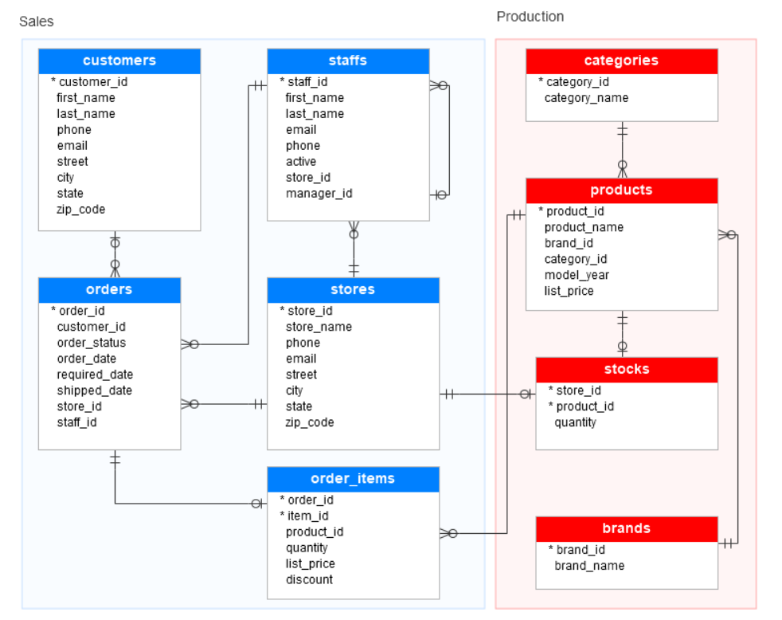
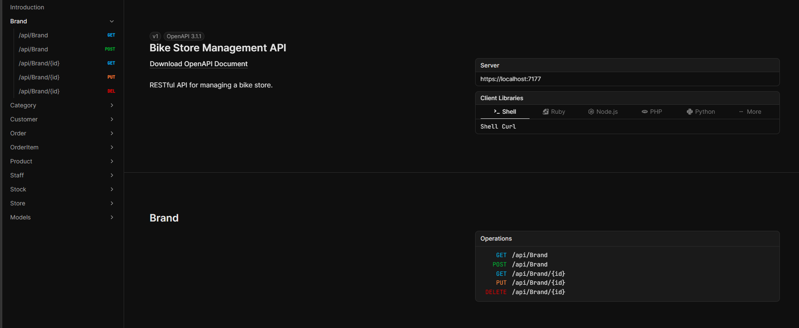
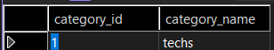
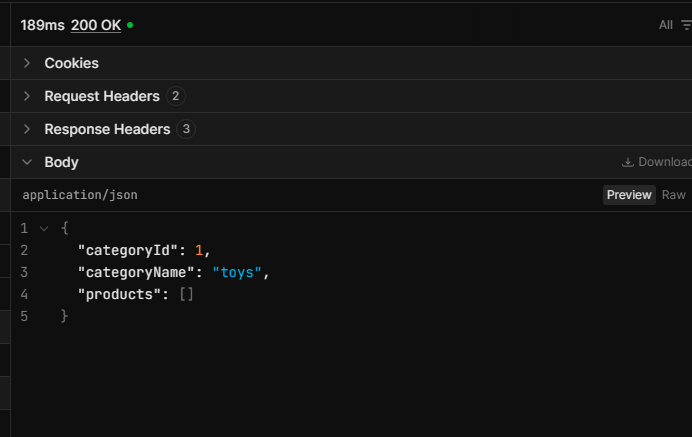
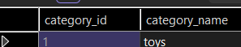

# Bike Store API 

A RESTful Web API built with **ASP.NET Core** and **Entity Framework Core** for managing the core operations of a bike store. The API provides endpoints for handling customers, products, orders, inventory, stores, and staff while following RESTful principles.

The project uses a **SQL Server** relational database designed from an Entity Relationship Diagram (ERD) and follows the **Database First** approach with Entity Framework Core Scaffolding.

---

# Overview

The application serves as the backend for a bike store management system, exposing RESTful endpoints that allow clients to perform operations on the store's data.

The project was developed through the following stages:

- Designing the relational database from an ERD.
- Implementing the database in SQL Server.
- Populating the database with realistic sample data generated using Mockaroo.
- Reverse engineering the database using Entity Framework Core Scaffolding.
- Developing RESTful API endpoints with ASP.NET Core.
- Documenting and testing RESTful endpoints using Scalar.

---

# Features

- RESTful API architecture.
- CRUD operations (GET, POST, PUT, DELETE) across multiple entities.
- Database First approach using Entity Framework Core.
- Entity Framework Core Scaffolding.
- SQL Server relational database with properly configured entity relationships.
- LINQ queries for efficient data retrieval.
- DTOs (Data Transfer Objects) for data transfer.
- Dependency Injection for service management.
- Data Annotations for model validation.
- Fluent API for entity configuration and relationships.
- Realistic sample data generated with Mockaroo.
- API testing and documentation using Scalar


---


# Technologies

### Backend

* ASP.NET Core Web API
* C#

### Database

* SQL Server
* Entity Framework Core
* Database First (Scaffold-DbContext)

### API Development

* RESTful APIs
* Scalar

### Programming Concepts

* LINQ
* Dependency Injection
* DTOs (Data Transfer Objects)
* Data Annotations
* Fluent API

### Tools

* Mockaroo

---

## Database Design

The database was designed from an Entity Relationship Diagram (ERD) before being implemented in SQL Server.

<p align="center">
  
</p>

The ERD defines the relationships between customers, orders, order items, products, brands, categories, stores, stocks, and staff, providing the foundation for the SQL Server database and RESTful API.

---

# Entities

The API includes endpoints for managing:

* Customers
* Orders
* Order Items
* Products
* Brands
* Categories
* Stocks
* Staffs
* Stores


---

## API Documentation (Scalar)

<p align="center">
  
</p>

## Initial Database State

Before updating the category, the database contains the following record.


<p align="center">
  
</p>


## Update Category (PUT Request)

The following request updates the category information through the API.

<p align="center">
  
</p>

## Updated Result

After executing the PUT request, the changes are successfully reflected in the database.

<p align="center">
  
</p>

---


# Installation

## Prerequisites

Before running the project, ensure you have the following installed:

* .NET SDK (compatible with the project version)
* SQL Server
* Git

## Clone the Repository

```bash
git clone https://github.com/your-username/BikeStore-API.git
cd BikeStore-API
```

## Restore Dependencies

```bash
dotnet restore
```

## Configure the Database

Update the connection string in `appsettings.json` to match your SQL Server instance.

```json
"ConnectionStrings": {
  "DefaultConnection": "Your SQL Server connection string"
}
```

Since this project uses the **Database First** approach, make sure the Bike Store database already exists in SQL Server before running the application.

## Run the Application

```bash
dotnet run
```

The API will start and display the local URL in the terminal.

## Test the API

Open the Scalar interface using the URL provided when the application starts (for example, `https://localhost:7177/scalar`) and test the available endpoints.


